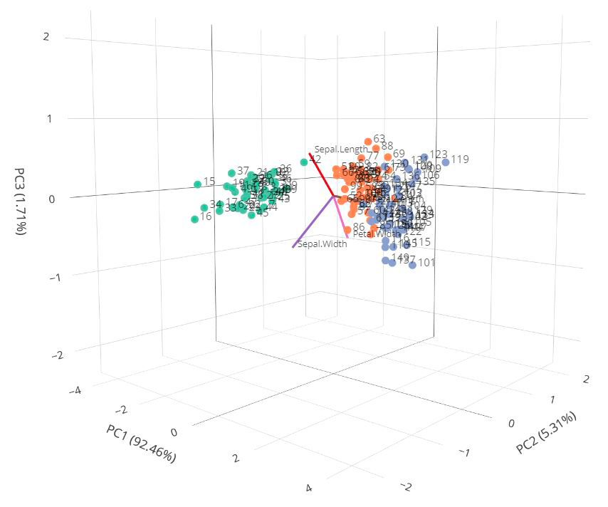

```{r, include = FALSE}
knitr::opts_chunk$set(
  collapse = TRUE,
  comment = "#>",
  fig.path = "man/figures/",
  out.width = "100%"
)
```

```{r load packages, include=FALSE}
library("BiPlotteR")
library("knitr")
```

# Getting Started with BiPlotteR

<center></center>

How many times did you wish to dive into a three-dimensional biplot, enjoying the dispersion of your data sample like in a sky full of stars? The `BiPlotteR` R-package makes it possible!
`BiPlotteR` is based on the `Plotly` interactive graphical interface and allows you to create captivating 2D and 3D biplots after performing the Principal Component Analysis using the prcomp function available in the "stats" R package.

### Install BiPlotteR

You can install the development version of `BiPlotteR` from GitHub.
For this purpose, you have to formerly install the `devtools` package.

``` r
install.packages("devtools")
devtools::install_github("AnCaste/BiPlotteR")
```

### Uninstall BiPlotteR

You can remove the `BiPlotteR` package in any moment using the following code line:

``` r
remove.packages("BiPlotteR")
``` 

### Load BiPlotteR

Prior to further operations, the content of the `BiPlotteR` package can be loaded into the R environment using the `library` function, as shown below.

``` r
library("BiPlotteR")
``` 

## Organize your Data

All the `BiPlotteR` functions require a definite input database structure. Specifically, the dataset has to be generated in R-mode, i.e. showing variables (features) in columns and samples (objects) in rows. Additionally, the first column should contain all the sample annotations (e.g. sample name, sample number, etc.), which will be displayed next to each point in the biplot. Furthermore, the second column has to be filled with parameters (e.g., types, species, treatments, etc.) useful for samples classification into groups. In this way, all the points referring to samples sharing the same properties will have the same color in the biplot. Variable values are listed starting from the third column onwards. Here, column headers should contain the name of the related feature. These names will be displayed next to the corresponding loading vector in the biplot.
As an example, the `BiPlotteR` package offers you the `Iris_4BPLTR` data frame as a template. This is an adaptation of the iris dataset (embedded in the "datasets" R-package) to the needs of the BiPlotteR functions. You can load it into the R environment using the following code line:

``` r
data("Iris_4BPLTR")
``` 
Here you can explore the content of the Iris_4BPLTR dataset:

```{r echo=FALSE}
data("Iris_4BPLTR")
kable(Iris_4BPLTR,align=rep('c', 6))
```

As you can see, the first column offers a number codification for the iris samples; more in general, the elements in the first column will appear as point annotations in the biplot when using the `Biplot 3D` and `Biplot 2D` functions.
The second column is dedicated to a-priori information about your samples; in this particular case, iris species are reported. When using the `Biplot 3D` and `Biplot 2D` functions, points referred to samples that have the same value in the second column of the dataset (the name of the species in this case) will be displayed with the same color in the biplot. This might help you to interpret the PCA output in light to your a-priori information. As previously mentioned, features values are listed from the third column onwards.

## The functions in the BiPlotteR package: Biplot3D

`Biplot 3D` performs PCA on your input dataset and generates an interactive three-dimensional biplot referred to the first three principal components (PC). This function will automatically center your input data matrix. However, data can be scaled to have unit variance before performing the Principal Component Analysis (PCA). If you want to scale your data, you have to specify it in the input as follows:

``` r
Biplot3D(Iris_4BPLTR,scaling="YES")
``` 

You can also use a loading filter to limit the number of the loading vectors which will be displayed in the biplot. If you want to, you have to define a threshold value so that only vectors having modules greater than such value will be shown in the biplot. For example, only vectors having modules greater than 0.2 will be displayed when the following code line is used.

``` r
Biplot3D(Iris_4BPLTR,load.filter=0.2)
``` 
By definition, the modules of loading vectors do not exceed 1. However, their lenght appear be too small if compared to scatter point coordinates on the principal component axis. You can than decide to introduce an artificial magnification of loading vectors. More properly, you can do it either by specifying a definite magnification factor, e.g. 2 as in the example below:

``` r
Biplot3D(Iris_4BPLTR,mag.fact=2)
``` 
or asking for an automatic magnification as follows:

``` r
Biplot3D(Iris_4BPLTR,mag.fact="AUTO")
``` 
[Here](https://chart-studio.plotly.com/~AnCaste/13/#/) you can explore an example of the interactive output of the `Biplot 3D` function.

## The functions in the BiPlotteR package: Biplot2D

`Biplot 2D` generates an interactive three-dimensional biplot referred to the two principal components (PC) indicated by the user. Similarly to `Biplot 3D`, the `Biplot 2D` function automatically centers the input data matrix. Analogously to `Biplot 3D`, you can decide to scale your data, to limit the number of the loading vectors in the biplot and to ask for loading vector modules amplification to increase the biplot intelligibility. (see above or the `Biplot 2D` help file for further details). Furthermore, the `Biplot 2D` allows you to decide which principal components will be displayed on the x and y axis. For example, if you want to put the PC2 on the x axis and the PC3 on the y axis, you have to specify the corresponding PCx and PCy values in the `Biplot 2D`, as shown in the example below:

``` r
data("Iris_4BPLTR")
Biplot2D(Iris_4BPLTR,scaling="NO",PCx=2,PCy=3,load.filter=0,mag.fact="NO")
```
[Here](https://chart-studio.plotly.com/~AnCaste/15) you can explore an example of the `interactive output of the Biplot 2D` function .

## The functions in the BiPlotteR package: ScreePlot

`ScreePlot` generates an interactive two-dimensional bar chart. The height of each bar shows the variance explained by the corresponding principal component. The screeplot returned by the `ScreePlot` function refers to the Principal Component Analysis performed on centered data. If scaling is needed, you have to specify it by setting `scaling="YES"` in the function input, as shown in the example below:

``` r
data("Iris_4BPLTR")
ScreePlot(Iris_4BPLTR,scaling="NO")
```
[Here](https://chart-studio.plotly.com/~AnCaste/17/#/) you can explore an example of the interactive output of the `ScreePlot` function.
